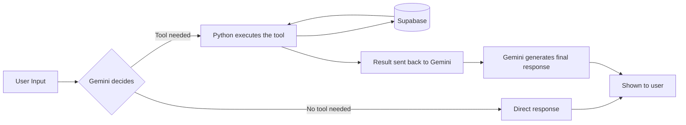

# Agent Core V1

**A hand-built AI agent — no framework, just the raw LLM → tool-call → execution → response loop.**


---

## Overview

Most "build an AI agent" tutorials lean on a framework (LangChain, CrewAI, etc.) that hides the actual mechanics behind a few lines of code. This project does the opposite: it's a minimal agent core built from scratch in Python to understand — and control — every step of that loop.

The agent connects a **Gemini** LLM to a live **Supabase** database. When the model decides it needs data, it doesn't guess — it calls a real Python function that queries Supabase and returns the actual result.

> This is a learning-focused "V1." It's intentionally small: one tool, one data source, no conversation memory yet. See [Limitations](#limitations--whats-next) below for what's coming.

## How It Works



1. The user types a question into the terminal.
2. Gemini receives the message plus a list of available tools and decides whether it needs one.
3. If it does, **my Python code — not the model — executes it.**
4. The tool queries Supabase directly and returns real data.
5. That result goes back to Gemini, which turns it into a final, natural-language answer.

## Tech Stack

| Layer | Technology |
|---|---|
| LLM | Google Gemini (via `google-genai`) |
| Tool execution | Plain Python functions — no agent framework |
| Data layer | Supabase (Postgres) |
| Config | `python-dotenv` |
| Interface | Command-line (Python `input()` loop) |

## Available Tools

| Tool | Description | Data Source |
|---|---|---|
| `get_lead_count` | Returns the current total number of leads | Supabase `leads` table |

## Production Handling

Even at this scale, the loop handles real failure points instead of assuming the happy path:

- **API failures** — Gemini calls are wrapped in a retry loop with exponential backoff on transient `ServerError`s (up to 3 retries), and fail fast on non-retryable `ClientError`s.
- **Tool failures** — if a tool throws an exception, it's caught and turned into a structured `{success: False, error: ...}` response instead of crashing the session.
- **Startup validation** — missing environment variables (`GEMINI_API_KEY`, `GEMINI_MODEL`, `SUPABASE_URL`, `SUPABASE_SECRET_KEY`) raise a clear error immediately instead of failing mysteriously later.

## Project Structure

```
Agent-Core-V1/
├── main.py            # Agent loop: input → tool selection → execution → response
├── get_lead_count.py  # Tool: queries Supabase for the current lead count
├── .env.example       # Environment variable template (copy to .env)
├── Data/
│   └── leads_rows.csv     # Sample lead data for local testing / Supabase import
├── requirements.txt
├── LICENSE
└── README.md
```

## Getting Started

### Prerequisites

- Python 3.10+
- A [Google Gemini API key](https://ai.google.dev/)
- A [Supabase](https://supabase.com/) project with a `leads` table

### 1. Clone the repo

```bash
git clone https://github.com/yousaf814/Agent-Core-V1.git
cd Agent-Core-V1
```

### 2. Install dependencies

```bash
pip install -r requirements.txt
```

### 3. Set up your environment variables

```bash
cd "Coding Files"
cp .env.example .env
```

Then fill in `.env`:

```env
GEMINI_API_KEY="your-gemini-api-key"
GEMINI_MODEL="your-gemini-model-name"
SUPABASE_URL="your-supabase-project-url"
SUPABASE_SECRET_KEY="your-supabase-secret-key"
```

### 4. Set up your Supabase table

Create a `leads` table. The sample data in `Data/leads_rows.csv` shows the expected shape:

| Column | Type | Example |
|---|---|---|
| `id` | integer | `1` |
| `created_at` | timestamp | `2026-09-08 19:23:30+00` |
| `name` | text | `Ali` |
| `email` | text | `ali@example.com` |
| `status` | text | `new` |
| `source` | text | `WhatsApp` |

You can import `Data/leads_rows.csv` directly through the Supabase Table Editor to get test data in quickly.

### 5. Run it

```bash
python main.py
```

### Example session

```
You: how many leads do we have right now?
Requested tool: get_lead_count
Arguments: {}
Gemini: You currently have 4 leads in the system.

You: exit
Agent: Goodbye!
```

## Limitations & What's Next

This is a foundation, not a finished product — logged here on purpose instead of glossed over:

- **No conversation memory** — each message is currently sent to Gemini on its own; there's no multi-turn history yet.
- **One tool** — the architecture supports more, but only `get_lead_count` is wired up so far.
- **Single tool call per turn** — if Gemini requests multiple tool calls at once, only the first is executed.
- **Console-only logging** — failures print to stdout; there's no structured logging yet.

**Planned next:**
- [ ] Add more tools (create/update a lead, search by status, etc.)
- [ ] Add multi-turn conversation memory
- [ ] Support multiple tool calls per turn
- [ ] Replace `print()`-based logging with structured logging
- [ ] Add automated tests around tool execution and the retry logic

## License

Distributed under the MIT License. See [`LICENSE`](LICENSE) for details.

## Author

**Yousaf Sulaiman**

- GitHub: [@yousaf814](https://github.com/yousaf814)
- LinkedIn: [](www.linkedin.com/in/yousaf-sulaiman-4ab7212a8)
